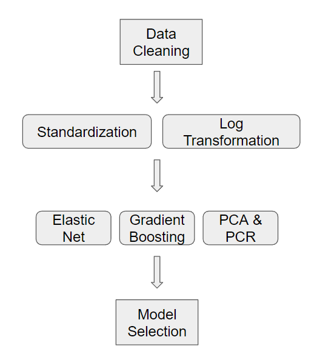

# QTM347Project

## Introduction
We are trying to build the best-predicting model for the price of an AirBnB in Hong Kong. 

A model like this would likely benefit both hosts and travelers, but moreso travelers. From the traveler's perspective, consumers can make more informed decisions if they can predict the price of an AirBnB at a given time. They may be able to find better deals and chepaer stays for their vacation. From a host's perspective, they can evaluate pricing strategies that will maximize rentals and revenues. This project also allows us to explore AirBnB in an Asian market, which most people are not very familiar with given AirBnB's popularity in the Western market and market trends may be different in Asia.

## Data
We gathered data from AirBnB's open dataset, found here: https://insideairbnb.com/get-the-data.

## Our Approach
We used three main approaches to tackle this issue of what the best predictors of a Hong Kong AirBnB price are:
1. **Linear regression with regularization** because it can prevent overfitting the model by penalizing the variables with high variability for better real-world test prediction accuracy.
2. **Principle Component Regression (PCR)** because it helps to reduce the dimensionality of a great number of predictors by handling multicollinearity between variables so that we can easily interpret the most important features for prediction.
3. **Gradient boosted regression** because it addresses the nonlinear relationships between variables, and therefore predicts with high accuracy.

The key components of our approach include partioning training and testing data, training each model on the training dataset, evaluating the test MSE on the test dataset, and then comparing the test MSEs from different models to find the best-predicting model with the lowest test MSE.

## Limitations

Our finding is first fundamentally limited to the modeling methods we included, as there might be other better choices, like XBoost and neural network, which are found to have high prediction accuracy (Yang, 2021). 

Secondly, our findings might not be optimal due to the small dataset we had compared to the datasets in other studies. For example, in a paper that predicted Airbnb prices in New York City with sentiment analysis, the dataset had more than 50000 listings (Rezazadeh Kalehbasti et.al, 2021). In another study that aimed to find the best-predicting model for Airbnb prices across cities, each of the three datasets had at least 20000 listings (Luo et.al, 2019). For reference, our dataset contianed 7,000 instances. This smaller dataset we used might not provide sufficient and reliable information for robust modeling.

Thirdly, our findings are limited to the features included in the model. In our study, we only looked at continuous and categorical features. However, there are other variables in the original dataset, like text data and date data, which might be helpful for prediction as well. 

## Setup
We used python for all of our analysis.

Our dataset contains 18 variables with 7,029 observations.

After splitting the variables, dropping columns with missing values, and creating dummy variables for categorical variables, we ended up with 33 features for the prediction of the variable “price”, including latitude and longitude of the Airbnb location, reviews per month, number of reviews, availability, bedroom counts, etc.

Our predicted variable price has an average of $115.9, but a high standard deviation of $370.75, and the max of the price is even up to $19500. There are about 400 outliers, and we decided to remove them from the final analysis because they didn’t account for much of the dataseg and our model results later indicated that the model had higher prediction accuracy without the outliers. 

The basic structure of our project can be found in the following diagram:

## Results

| Model (with Outliers) | Optimal Parameters | Test MSE |
| --------------- | --------------- | --------------- |
| PCR    | 28 Principle Components   | 0.35    |
| Elastic Net    | $\alpha$ = 0.01, $L_1$ ratio = 0   | 0.037   |
| Gradient Boosting    | max_depth=7, min_sample_split=8, n_estimators=140   | 0.18   |

| Model (with Outliers) | Optimal Parameters | Test MSE | Computaional Cost (seconds) |
| --------------- | --------------- | --------------- | --------------- | 
| PCR    | 28 Principle Components   | 0.19 | 250 |
| Elastic Net    | $\alpha$ = 0.01, $L_1$ ratio = 0   | 0.20   | 32 |
| Gradient Boosting    | max_depth=7, min_sample_split=82, n_estimators=180   | 0.09 | 300 |

In running these three models, we found  the best-predicting model to be the gradient-boosted regression, which hsa the lowest MSE. For each model, with or without parameters, had almost identical parameters, however the test MSE for the models without outiliers is generally about half of those models with outliers. 

Therefore, we decided that removal of outliers for our final analysis would improve the prediction accuracy of our models.

### PCR
We ran 5-fold cross validation to find the optimal number of principle components, found to be 28.

We also found the explained variance for each principle component: Few principle components  account for a siginificant portion of the variance in the data. Even the first, most significant principle component accounted for less than 10% of the variance.

### Linear Regression w/ Regularization
We ran 5-fold cross-validation to find the optimal alpha being 0.1 and $L_1$ ratio to be 0.0, corresponding to a ridge model.

We also found the top 5 most important gratures, being:
1. Home Type (home vs apartment)
2. Room Type (shared or private)
3. District location
4. Bathroom Count
5. Bedroom Count

### Gradient Boosted Regression
We used 5-fold cross validation to find the optimal depthm number of estimators, and number of samples per split. We found the max depth to be 7, minimum sample split to be 8, and the number of estimators to be 140.

We also found the most important features:
1. Host's number of listings
2. Room Type
3. Minimum Number of Nights
4. Latitude/Longitude
5. Bedroom Count

## Discussion
Gradient boosting has the lowest MSE. This is expected because of gradient boosting’s ability to handle non-linear relationships and its high prediction accuracy. On the other hand, both PCR and linear regression with regularization assume a linear relationships between variables, which might not address the complexity within variables. 

We had expected PCR to have higher accuracy than linear regression with regularization, but this did not happen. It might be because the features are not highly correlated with each other, which means that dimension reduction will not be as effective and keeps almost the same amount of features in the linear regression as the linear regression regularization model. 

The most important features generated from linear regression and gradient boosting regression are different. It’s interesting to see that dummy variables, like room type and district location of the Airbnb, have more importance in linear regression model while continuous variables, like the total number of listings for a host, minimum number of stay nights, and longitude, have higher importance in gradient boosting regression.

## Conclusion
In this project, we adopted three machine learning model methods, which are PCR, linear regression with regularization, and gradient boosting regression, to build the best-predicting model for Airbnb prices in Hong Kong. Our project found that gradient boosting regression had the highest prediction accuracy with the lowest test MSE. The most important features of the model included calculated host listings count, room type as entire home/apartment, the number of minimum nights for renting, latitude, longitude, and the number of bedrooms. 

## References
Luo, Y., Zhou, X., & Zhou, Y. (2019). Predicting airbnb listing price across different cities.

Rezazadeh Kalehbasti, P., Nikolenko, L., & Rezaei, H. (2021, August). Airbnb price prediction using machine learning and sentiment analysis. In International Cross-Domain Conference for Machine Learning and Knowledge Extraction (pp. 173-184). Cham: Springer International Publishing.

Yang, S. (2021, March). Learning-based airbnb price prediction model. In 2021 2nd International Conference on E-Commerce and Internet Technology (ECIT) (pp. 283-288). IEEE.